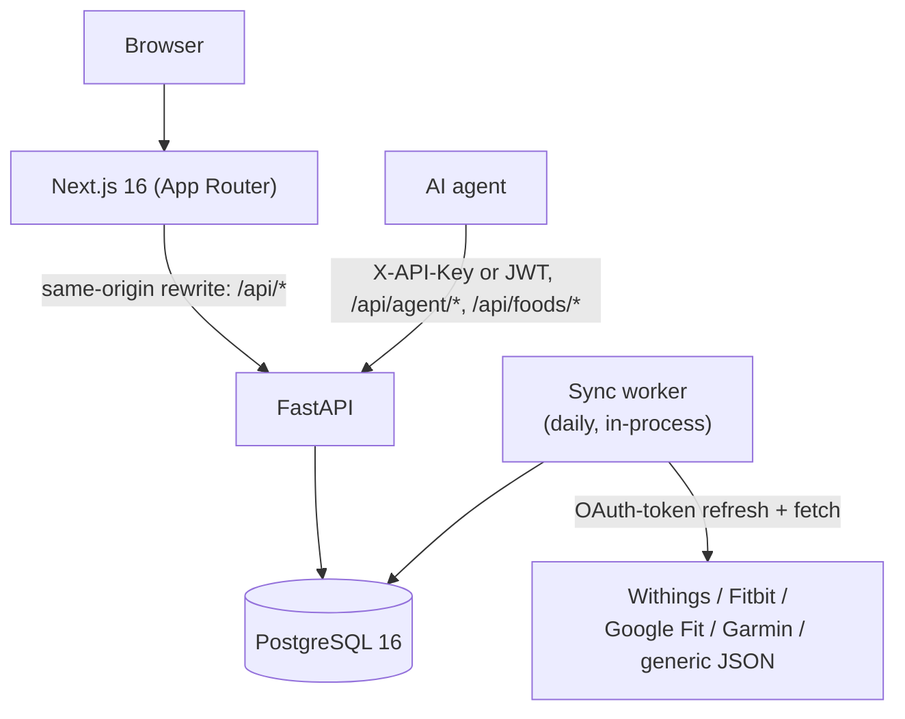

# NutriPilot

A self-hosted nutrition and body-composition tracker: an agent-first API (an
AI agent logs food, weight, and supplements from natural language) plus a
full web dashboard for browsing and editing the same data by hand.

Built as a portfolio project — see [Architecture](#architecture) and
[Security model](#security-model) below for the parts worth reading as code
samples.


## Features

- **Food logging** — search a local database with fuzzy matching, scan a
  barcode (camera or manual entry), or log by name. Falls back to
  OpenFoodFacts and USDA FoodData Central when a barcode isn't known locally.
  Includes a curated Swiss food database.
- **Custom foods with an ownership model** — the shared/official catalog is
  read-only; any user can clone an official food to customize it, or add a
  brand-new food they own outright. Only the owner can edit or delete their
  own foods (enforced server-side, not just hidden in the UI).
- **Body composition** — log weight, body fat %, and muscle mass manually, or
  connect a smart scale. Sync worker integrations for Withings, Fitbit,
  Google Fit, and Garmin, plus a generic JSON adapter for anything else.
- **Supplements** — define supplement profiles with dose and micronutrient
  content, then log daily intake.
- **Water & caffeine** — water logged directly; caffeine tracked
  automatically from the `caffeine_mg` field on logged foods, no separate
  entry needed.
- **Statistics & streaks** — 1–365 day rolling stats, adherence, records, and
  streaks across macros, body comp, and habits.
- **Per-user timezone** — "today" and daily/weekly boundaries are computed in
  each user's own configured timezone, not the server's.
- **PWA** — installable on iOS/Android/desktop.

## Architecture



Next.js never calls the backend cross-origin: `next.config.ts` rewrites
`/api/*`, `/health`, `/docs`, and `/openapi.json` to the FastAPI service
(`INTERNAL_API_URL`, defaulting to `http://api:8000` inside Compose), so the
browser only ever talks to Next.js. The sync worker runs inside the API
process (`app/services/sync_worker.py`), refreshing integration OAuth tokens
and pulling the latest body-comp reading on a daily loop started from
`app/main.py`'s lifespan handler.

## Tech stack

| Layer | Technology |
|---|---|
| Frontend | Next.js 16 (App Router), TypeScript (strict), Tailwind CSS, shadcn/ui, TanStack Query, Recharts |
| Backend | FastAPI, Python 3.12, SQLAlchemy (async), Alembic |
| Database | PostgreSQL 16 (pg_trgm for fuzzy food search) |
| Auth | JWT (PyJWT) for the dashboard, per-user `X-API-Key` for the agent — both accepted on agent/food endpoints |
| External data | OpenFoodFacts + USDA FoodData Central (barcode fallback), Withings / Fitbit / Google Fit / Garmin (body comp sync) |
| Infra | Docker Compose, Caddy (reverse proxy for the production/tunnel profiles) |

## Security model

- **Dual auth on agent-facing routes.** `/api/agent/*` and `/api/foods/*`
  accept either a JWT bearer token (dashboard) or a per-user `X-API-Key`
  header (agent), via a single `get_current_user_jwt_or_api_key` dependency
  (`backend/app/auth/dependencies.py`) so behavior can't drift between the
  two call paths.
- **Constant-time API key comparison** — key lookup narrows to a row by
  equality, but the final accept/reject uses `hmac.compare_digest` to avoid
  timing side-channels.
- **User-scoped queries everywhere**, backed by an IDOR test suite
  (`backend/tests/test_isolation.py`) that asserts one user can never read,
  modify, or delete another user's foods, logs, integrations, or settings.
- **Food ownership** — the shared catalog (`created_by IS NULL`) is
  read-only for everyone; user-owned foods can only be edited/deleted by
  their owner. Attempting to edit an official food returns
  `403 FOOD_READ_ONLY`; editing someone else's food returns
  `403 NOT_FOOD_OWNER`.
- **Encryption at rest for integration credentials.** OAuth tokens and
  client secrets stored on an `Integration` row are encrypted transparently
  at the SQLAlchemy type layer (`app/services/crypto.py`, Fernet via
  `TypeDecorator`), so no call site can forget to encrypt. `TOKEN_ENCRYPTION_KEY`
  accepts a comma-separated list of Fernet keys — the first encrypts, all of
  them can decrypt — enabling zero-downtime key rotation.
- **SSRF guard** (`app/services/url_guard.py`) rejects any user/agent-supplied
  integration URL that resolves to a loopback, RFC1918-private, link-local
  (including the `169.254.169.254` cloud metadata address), CGNAT, multicast,
  reserved, or unspecified address, IPv4 or IPv6, before the sync worker or
  an integration setup call ever makes the request.
- **Rate limiting** (slowapi) on login/refresh and other sensitive endpoints.
- **Security headers** on every response (`X-Content-Type-Options`,
  `X-Frame-Options`, `Referrer-Policy`, `Permissions-Policy`, HSTS from the
  Next.js layer) via middleware in both `app/main.py` and `next.config.ts`.
- **Production config validation** — `app/config.py` refuses to start with
  `ENVIRONMENT=production` if `JWT_SECRET`, `CORS_ORIGINS`, or
  `TOKEN_ENCRYPTION_KEY` are left at their development defaults. `/docs` and
  `/redoc` are also disabled in production.
- **Secrets only via environment variables** — nothing sensitive is
  hardcoded or committed; see [Environment variables](#environment-variables).

## Quickstart

### Prerequisites

- Docker & Docker Compose

### 1. Clone and configure

```bash
git clone https://github.com/your-org/nutripilot.git
cd nutripilot
cp .env.example .env
```

Edit `.env` — at minimum set `POSTGRES_PASSWORD` and `JWT_SECRET`. Generate a
`TOKEN_ENCRYPTION_KEY` with:

```bash
python -c "from cryptography.fernet import Fernet; print(Fernet.generate_key().decode())"
```

### 2. Start

```bash
docker compose up -d --build
```

The `api` container runs `alembic upgrade head` before starting `uvicorn`
(see the `command:` in `docker-compose.yml`) — migrations run once, on
container start, not from the app's lifespan, so multiple workers never race
each other applying the same migration.

| Service | Default URL |
|---|---|
| Dashboard (Next.js) | http://localhost:3099 |
| API (FastAPI) | http://localhost:8099 |
| API docs | http://localhost:8099/docs *(dev only — disabled when `ENVIRONMENT=production`)* |

### 3. Seed a user

```bash
docker compose exec api python -m seed
```

Reads `SEED_EMAIL` / `SEED_PASSWORD` / `SEED_API_KEY` from the environment,
falling back to a randomly generated password and API key (printed once, not
stored anywhere) when unset.

For a fuller demo — three months of realistic food/weight/supplement history
so every dashboard page and chart has something to show — use:

```bash
docker compose exec api python -m seed_demo
```

This creates a fixed `demo@nutripilot.dev` account with deterministic fake
data; screenshots in this README should be taken against that account.

## Environment variables

All variables are documented in [`.env.example`](.env.example).

| Variable | Required | Default | Description |
|---|---|---|---|
| `POSTGRES_USER` | no | `nutripilot` | PostgreSQL user |
| `POSTGRES_PASSWORD` | **yes** | — | PostgreSQL password |
| `POSTGRES_DB` | no | `nutripilot` | PostgreSQL database name |
| `DATABASE_URL` | no | derived from the `POSTGRES_*` values | Full async SQLAlchemy DSN, override to point at an external Postgres |
| `JWT_SECRET` | **yes** | — | Signs all access/refresh JWTs (min 32 chars) |
| `TOKEN_ENCRYPTION_KEY` | **yes in production** | dev-only fixed key | Fernet key(s), comma-separated, encrypting integration credentials at rest |
| `CORS_ORIGINS` | **yes in production** | `http://localhost:3000` | Comma-separated list of allowed browser origins |
| `USDA_API_KEY` | no | — | USDA FoodData Central API key (free tier), used as a barcode fallback |
| `SEED_EMAIL` / `SEED_PASSWORD` / `SEED_API_KEY` | no | random | Used only by `backend/seed.py`; unset values are generated randomly and printed once |
| `ENVIRONMENT` | no | `dev` | Set to `production` to enforce the secret checks above and disable `/docs`/`/redoc` |
| `NEXT_PUBLIC_API_URL` | no | `/api` | Build-time base path baked into the frontend production build |
| `INTERNAL_API_URL` | no | `http://api:8000` | Where the Next.js rewrite proxies `/api/*`, `/health`, `/docs`, `/openapi.json` (server-side only, never sent to the browser) |
| `DOMAIN` | no | `localhost` | Hostname Caddy listens on in the production/tunnel Compose profiles |

There is no global agent API key: `/api/agent/*` and `/api/foods/*` accept a
**per-user** API key (issued by `seed.py`, visible masked in dashboard
settings, and rotatable via `POST /api/v1/settings/regenerate-api-key`) or a
JWT — see [Security model](#security-model).

## Testing

```bash
cd backend
pip install -e ".[dev]"
ruff check .
pytest --tb=short -q
```

106 tests, run fully offline against an in-memory SQLite database — no
Postgres or network access required for most of them. Notable suites:

- `test_isolation.py` — the IDOR suite (cross-user access must always fail)
- `test_food_ownership.py` — clone/edit/delete rules for official vs. owned foods
- `test_encryption.py` — integration credentials round-trip through Fernet
- `test_url_guard.py` — SSRF guard rejects private/loopback/metadata targets
- `test_sync_worker.py` — integration sync + OAuth token refresh
- `test_migrations.py` — **dockerized**: spins up a throwaway
  `postgres:16-alpine` container, runs the real Alembic migrations against
  it, and asserts the resulting schema matches the SQLAlchemy models —
  automatically skipped if Docker isn't available locally, but runs in CI

CI (`.github/workflows/ci.yml`) runs `ruff check`, the full pytest suite, and
a frontend lint + production build on every push/PR.

```bash
cd frontend
npm ci
npm run lint
npm run build   # production build
npm run dev     # dev server on :3000
```

## Project structure

```
nutripilot/
├── backend/
│   ├── app/
│   │   ├── auth/          # JWT + API-key dependencies
│   │   ├── models/        # SQLAlchemy models
│   │   ├── routers/       # auth, foods, agent/*, dashboard, settings
│   │   ├── schemas/       # Pydantic request/response models
│   │   ├── services/      # crypto, url_guard, sync_worker, food/summary services
│   │   ├── external/      # OpenFoodFacts / USDA clients
│   │   ├── config.py      # Settings + production secret validation
│   │   ├── docs.py        # agent-facing OpenAPI description
│   │   └── main.py        # app wiring, middleware, lifespan
│   ├── alembic/versions/  # migrations (Postgres-only DDL)
│   ├── tests/
│   ├── seed.py            # minimal user seed
│   └── seed_demo.py       # 3-month demo dataset
└── frontend/
    └── src/
        ├── app/           # Next.js App Router pages
        ├── components/    # UI, grouped by domain
        ├── hooks/         # TanStack Query queries + mutations
        └── lib/           # api client, types, formatting, validation
```

## Screenshots

> Add screenshots here, taken against the `demo@nutripilot.dev` account
> produced by `docker compose exec api python -m seed_demo` — not real
> personal data.

## License

[MIT](LICENSE)
